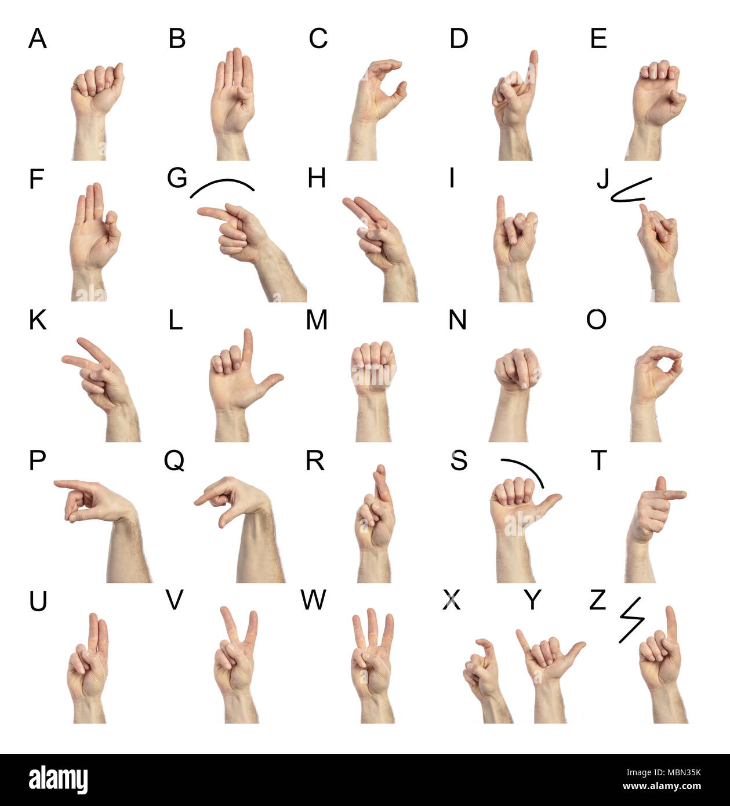

# Real-Time Hand Pose Recognition (ASL A–J)

Recognise American Sign Language (ASL) letters **A through J** in real time using your webcam, or snap a photo and get an instant prediction, powered by **MediaPipe** hand landmarks and a tuned **SVM** classifier.



### Demo

https://github.com/user-attachments/assets/ASL_Demo.mp4

---

## Features

- **Streamlit web app** — take a photo from your browser and get a prediction in seconds.
- **Real-time webcam mode** — live predictions rendered directly on the video feed via OpenCV.
- **MediaPipe hand landmarks** — 21 key-points extracted per hand for robust pose estimation.
- **SVM classifier (RBF kernel, C = 10)** — selected through 5-fold GridSearchCV over multiple kernels and regularisation strengths.
- **Data pipeline** — automated landmark extraction, dataset cleaning, and CSV export.

---

## Quick Start

### Prerequisites

- Python **3.12+**
- A webcam

### Installation

```bash
# Clone the repo
git clone https://github.com/<your-username>/realtime-hand-pose-recognition.git
cd realtime-hand-pose-recognition

# Create a virtual environment & install dependencies
python -m venv .venv
source .venv/bin/activate   # Windows: .venv\Scripts\activate
pip install -e .
```

### Run the Streamlit App

```bash
streamlit run main.py
```

Take a photo of your hand signing an ASL letter (A–J) and the app will detect the hand, draw landmarks, and display the predicted letter.

### Run Real-Time Mode

For **live, continuous predictions** straight from your webcam:

```bash
python landmark.py
```

A window will open showing the camera feed with hand landmarks and the predicted letter overlaid in real time. Press **Q** to quit.

---

## Project Structure

```
.
├── main.py                # Streamlit web app (photo capture + prediction)
├── landmark.py            # Real-time webcam detection & model training
├── preprocessing.py       # Dataset landmark extraction & cleaning
├── models/
│   └── best_model.pkl     # Trained SVM model
├── mediapipe/
│   └── hand_landmarker.task  # MediaPipe hand landmarker model
├── asl.jpg                # ASL letter reference chart
├── pyproject.toml         # Project metadata & dependencies
└── README.md
```

---

## How It Works

1. **Data preprocessing** (`preprocessing.py`)
   - Images are fed through MediaPipe's Hand Landmarker.
   - 21 (x, y) landmark coordinates are extracted per image.
   - Clean images (with detected landmarks) are saved separately from bad images.
   - All landmark data is exported to a CSV for training.

2. **Model training** (`landmark.py`)
   - Landmarks are flattened into a 42-feature vector (21 x-coords + 21 y-coords).
   - GridSearchCV evaluates SVM and Logistic Regression across multiple hyper-parameters.
   - The best model — **SVC with RBF kernel, C = 10** — is serialised with `joblib`.

3. **Inference**
   - *Streamlit app*: captures a photo, extracts landmarks, runs the model, and displays the result.
   - *Real-time mode*: streams webcam frames, extracts landmarks per frame, and overlays predictions on the live feed.

---

## Model Performance

| Detail              | Value                |
|---------------------|----------------------|
| Classifier          | SVM (RBF kernel)     |
| Regularisation (C)  | 10                   |
| Cross-validation    | 5-fold GridSearchCV  |
| Dataset size        | 3,648 samples        |
| Classes             | A, B, C, D, E, F, G, H, I, J |

---

## Tech Stack

- **[MediaPipe](https://ai.google.dev/edge/mediapipe/solutions/vision/hand_landmarker)** — hand landmark detection
- **[scikit-learn](https://scikit-learn.org/)** — SVM classifier & model evaluation
- **[Streamlit](https://streamlit.io/)** — interactive web interface
- **[OpenCV](https://opencv.org/)** — image/video processing
- **[pandas](https://pandas.pydata.org/)** — data handling

---

## License

This project is provided as-is for educational and personal use.
